# PBDS

## Repo Structure

```text
.
├── docs                                  # Documents Folder.
├── source                                # Contains Source Code of Mobile & Web Apps.
└── README.MD                             # Readme file.
└── LICENCE                               # Licence file.
```

## 01 Introduction
The Organ Donation App is an integrated mobile and web-based platform designed to facilitate communication and management between patients seeking organ transplants and hospitals providing them. This app aims to streamline the organ donation process by offering essential functionalities, such as organ match identification, organ requests, and direct communication with hospitals. The platform is structured into two main components:

Mobile Application: Primarily designed for end-users (patients), the mobile app enables users to search for organ matches, request organs, and communicate directly with hospitals. It provides a user-friendly experience that guides patients through requesting an organ, receiving match notifications, and sending messages to hospital representatives.

Backend Management Panel: Accessible to hospital administrators and medical personnel, the backend panel serves as a centralized hub for managing patient requests, responding to messages, approving or denying organ requests, and monitoring overall user interactions. This panel streamlines administrative workflows, ensuring that hospital staff can manage cases efficiently and reach out to patients seamlessly.

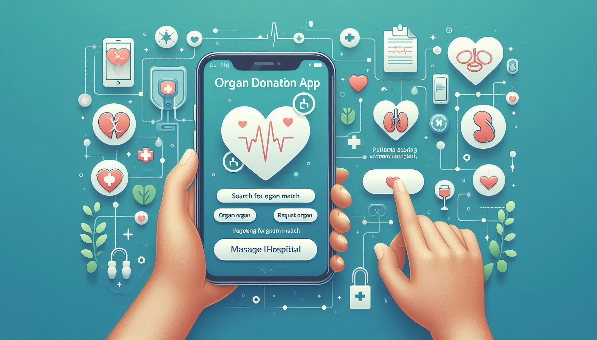

## 02 Technology Stack

The Organ Donation App is built using the following technology stack:

- **Flutter**: For the mobile frontend, providing a smooth and responsive user interface for patients.
- **Laravel**: For the backend, managing server-side operations and handling API requests.
- **MySQL**: Used as the database to store and manage data related to organ requests, user information, and interactions between patients and hospitals.


## 03 Setup Web App

Here, we are setting up the Web App. Later, we will provide instructions to set up the mobile app.

**Web App Source Folder:** `source/web-app`


### Step 01: Setup database 

```
php artisan migrate
```

Note: A populated database is already available and can be found inside docs/organ_app.sql. You can also import it manually if needed.

### Step 02: Setup .env file from .env

```
APP_NAME=OrganApp
APP_ENV=local
APP_KEY=base64:yj7t43y+JJ+syX8zNcf+YIgEyvgIMRAm23RiDRPJavU=
APP_DEBUG=true
APP_TIMEZONE=UTC
APP_URL=http://localhost

DB_CONNECTION=mysql
DB_HOST=127.0.0.1
DB_PORT=3306
DB_DATABASE=organ_app
DB_USERNAME=root
DB_PASSWORD=
```

### Step 03: Install Dependencies

```
composer install
```

### Step 04: Generate an APP_KEY

```
php artisan key:generate
```


### Step 05: Run App

```
php artisan serve
```

## 04 Setup Mobile App

In this section, we will set up the mobile app, designed for patients to search for organ matches, request organs, and communicate with hospitals directly. 

**Mobile App Source Folder:** `source/mobile-app`


### Step 01: Open the App using Android Studio

```
source/mobile-app
```

### Step 02: Clean build and caches


```
flutter clean
```

### Step 03: Install Dependencies

```
flutter pub get
```

### Step 04: Run the App

```
flutter run
```

**Important Note**: 
Ensure the Laravel backend is started before running the mobile app. Without the backend server running, the app will not be able to connect to the database or perform any backend tasks.

If you are not using localhost for the backend, update the endpoint in `lib/config.dart:`

```dart
// lib/config.dart

class Config {
  static const String baseUrl = 'http://10.0.2.2:8000/api';
}

```

We are using Laravel as the backend framework to manage database interactions and server-side functionalities. Ensure the Laravel backend is started before running the mobile app. Without the backend server running, the app will not be able to connect to the database or perform any backend tasks.


## 05 Demo

### 5.1 Web App

#### 5.1.1 Login Screen


#### 5.1.2 Dashboard

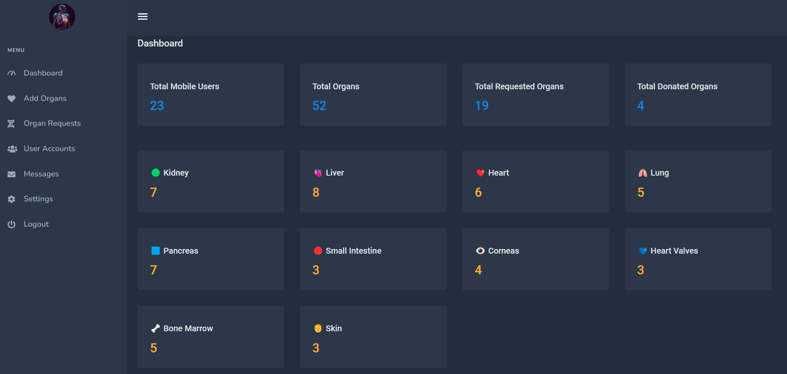

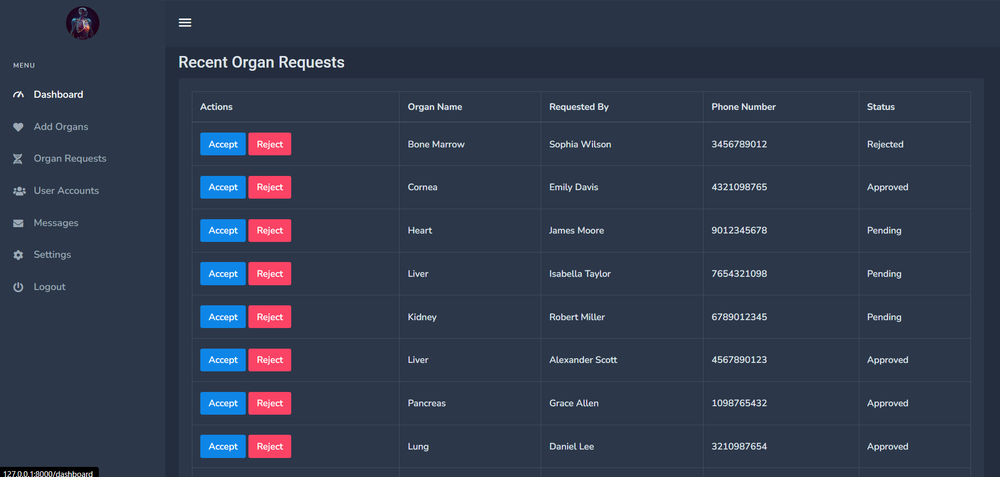

#### 5.1.3 Add Organs

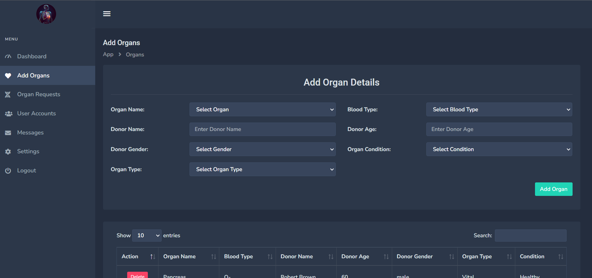

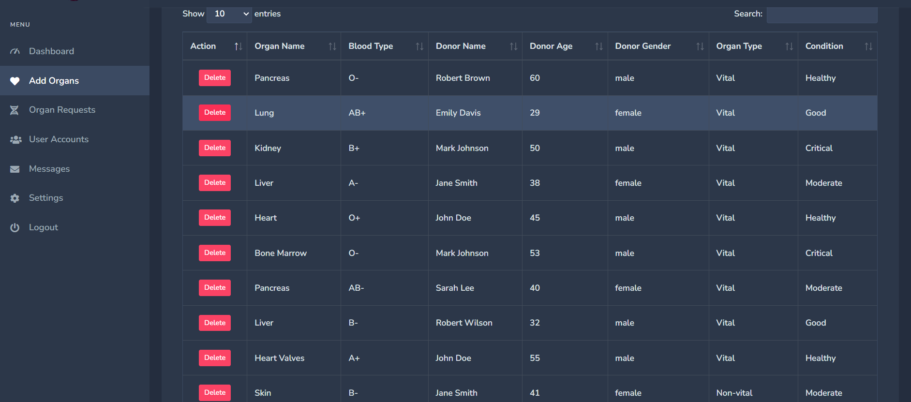

#### 5.1.4 Request Organs

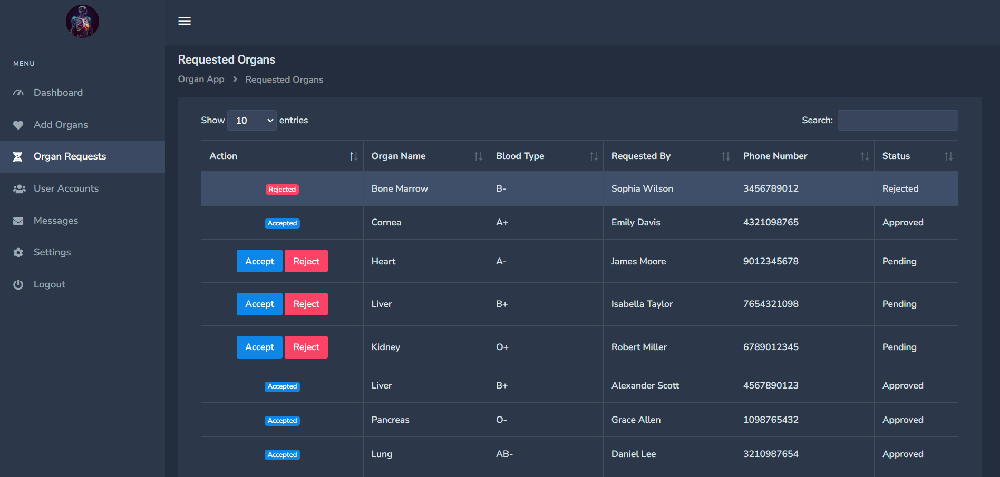

#### 5.1.5 Mobile User Management

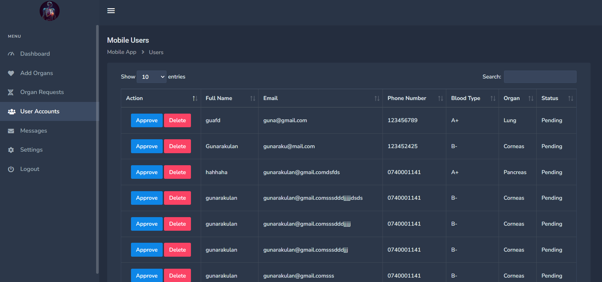

#### 5.1.6 Messages

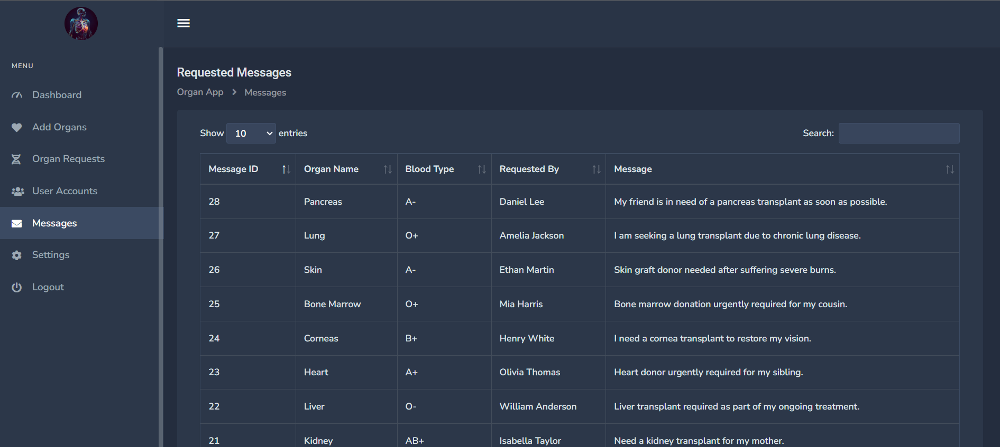

#### 5.1.7 Settings

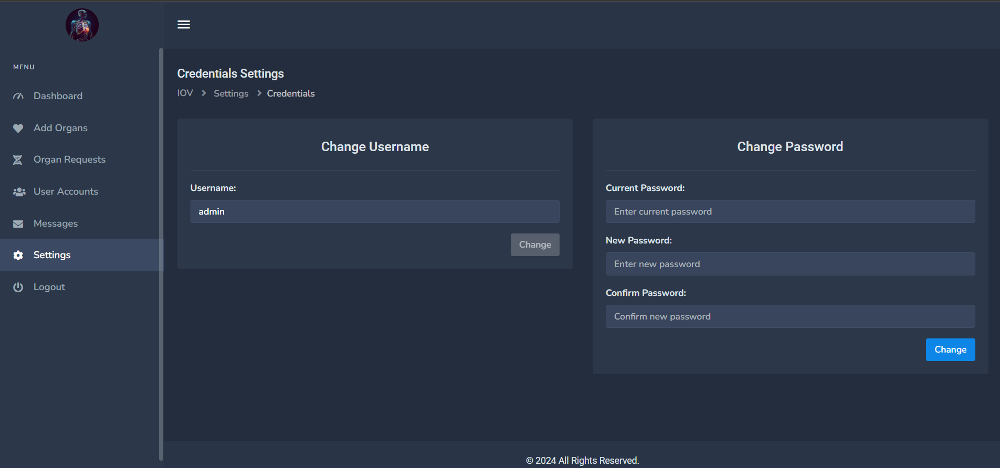


### 5.2 Mobile App

#### 5.2.1 Get Started

  
  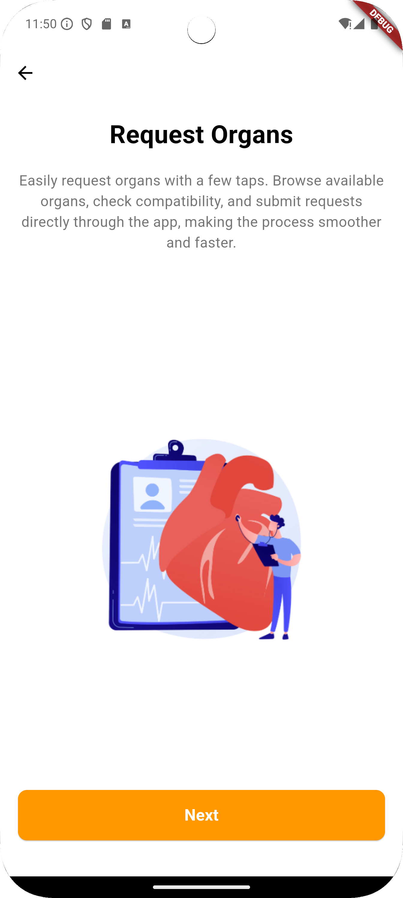
  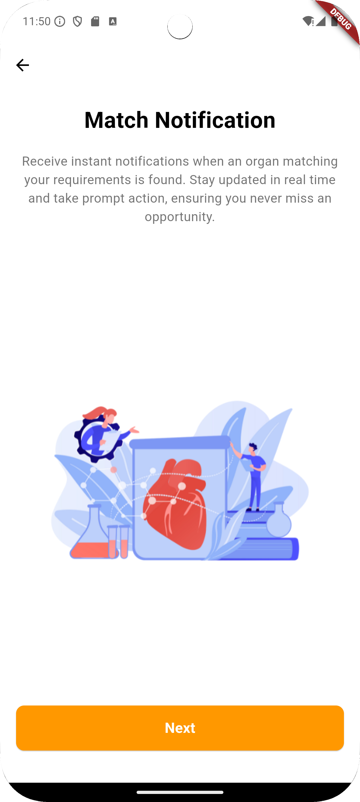
  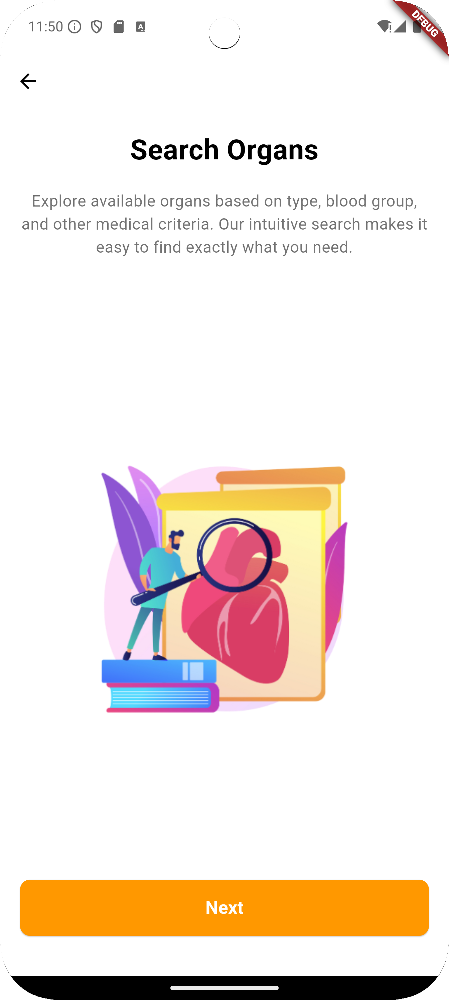
  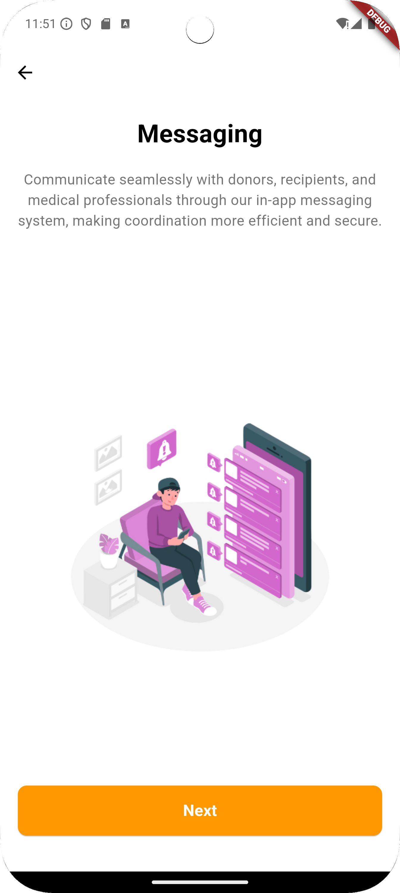


